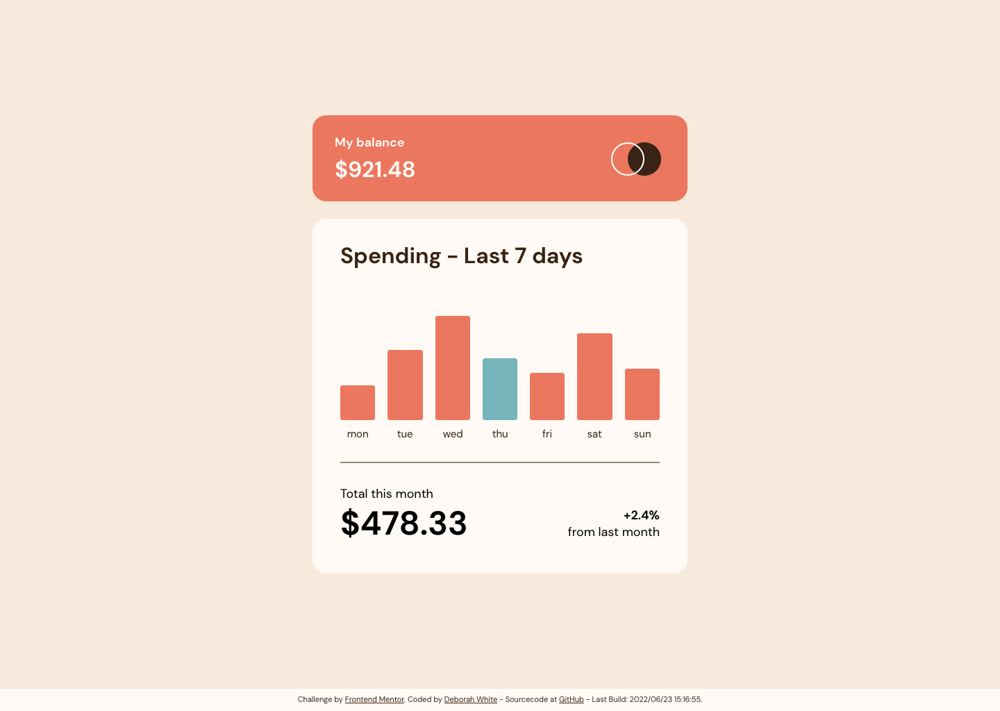

# Frontend Mentor - Expenses chart component solution

[](https://github.com/gelbehexe/frontend-mentor-expenses-chart-component-main/actions/workflows/code-quality-check.yml)

This is a solution to the [Expenses chart component challenge on Frontend Mentor](https://www.frontendmentor.io/challenges/expenses-chart-component-e7yJBUdjwt). Frontend Mentor challenges help you improve your coding skills by building realistic projects. 

## Table of contents

- [Overview](#overview)
  - [The challenge](#the-challenge)
  - [Screenshot](#screenshot)
  - [Links](#links)
- [My process](#my-process)
  - [Built with](#built-with)
  - [What I learned](#what-i-learned)
  - [Continued development](#continued-development)
  - [Useful resources](#useful-resources)
- [Author](#author)

## Overview

### The challenge

Users should be able to:

- View the bar chart and hover over the individual bars to see the correct amounts for each day
- See the current day’s bar highlighted in a different colour to the other bars
- View the optimal layout for the content depending on their device’s screen size
- See hover states for all interactive elements on the page
- **Bonus**: Use the JSON data file provided to dynamically size the bars on the chart

### Screenshot



### Links

- Solution URL: [Source code on GitHub](https://github.com/gelbehexe/frontend-mentor-expenses-chart-component-main)
- Live Site URL: [My live page on a server](https://frontend-mentor-expenses-chart-component-main-gelbehexe.netlify.app/)

## My process

### Built with

- Semantic HTML5 markup
- CSS custom properties
- Flexbox
- CSS Grid
- Mobile-first workflow
- [Sass](https://sass-lang.com/) - Sass stylesheet language
- [JavaScript](https://developer.mozilla.org/en-US/docs/Web/JavaScript/Reference) - JavasScript language
- [webpack](https://webpack.js.org/) - Static module bundler
- [HtmlWebpackPlugin](https://github.com/jantimon/html-webpack-plugin/blob/main/README.md) - HTML file creator (webpack plugin)
- [postcss](https://postcss.org/) - CSS transformer with JavScript
- [eslint](https://eslint.org/) - Static code analyzer
- [stylelint](https://stylelint.io/) - Static code analyzer for css/scss
- [prettier](https://prettier.io/) - An opinionated code formatter
- [babel](https://babeljs.io/) - JavaScript compiler

### What I learned

I learned to use CSS grid templates with named areas and responsive area, extended code generation.

Using relative heights with CSS Grid and its alignment system. Also I used the attributes to display the day and the amount:

```html
<div class="graph">
    <div class="graph__day" data-label="mon" data-value="$0.00"><div class="rounded-sm"></div></div>
    <div class="graph__day" data-label="tue" data-value="$0.00"><div class="rounded-sm"></div></div>
    <div class="graph__day" data-label="wed" data-value="$0.00"><div class="rounded-sm"></div></div>
    <div class="graph__day" data-label="thu" data-value="$0.00"><div class="rounded-sm"></div></div>
    <div class="graph__day" data-label="fri" data-value="$0.00"><div class="rounded-sm"></div></div>
    <div class="graph__day" data-label="sat" data-value="$0.00"><div class="rounded-sm"></div></div>
    <div class="graph__day" data-label="sun" data-value="$0.00"><div class="rounded-sm"></div></div>
</div>
```
```scss
.graph {
    height: 150px;
    display: grid;
    grid-auto-columns: 1fr;
    grid-auto-flow: column;
    align-items: flex-end;
    // ...

    &__day {
        height: var(--amount-percent, 50%);
        // ...
    }

    // ...

    // displaying attribute values
    &:before {
      content: attr(data-value);
        // ...
    }
    &:after {
        content: attr(data-label);
        // ...
    }
}
```
```js
/**
 * @typedef {Object} Item
 * @property {string} day
 * @property {number} amount
 *
 * @param {Item[]} items
 */
function applyData(items) {
    // calculate 100%
    const max = items.reduce((carry, item) => Math.max(carry, item.amount), 0);

    // get current day name
    const today = new Date()
        .toLocaleDateString("en-US", { weekday: "short" })
        .toLocaleLowerCase();

    items.forEach((item) => {
        const amountFormatted = `$${item.amount}`;
        const percent = Math.round((item.amount / max) * 100);
        const el = document.querySelector(
            `.graph__day[data-label="${item.day}"]`
        );
        el.setAttribute("data-value", amountFormatted);
        el.toggleAttribute("data-current", item.day === today);
        el.style.setProperty("--amount-percent", `${percent}%`);
    });
}
```


### Continued development

I think for now it's done.

### Useful resources

See [Build with](#built-with)

## Author

- Frontend Mentor - [@gelbehexe](https://www.frontendmentor.io/profile/gelbehexe)
